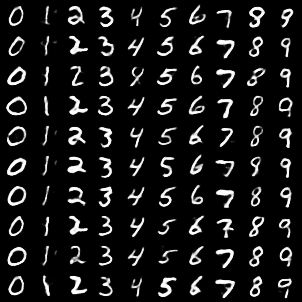

We implement a GPT style autoregressive image generator built on a VQ-VAE architecture. We train our model on the MNIST dataset. Both the VQ-VAE and transformer were trained locally on a MacBook Pro M4 GPUs (on the Metal Performance Shaders). Below are some samples of the final result.

# To run

First you need to train the VQ-VAE system.

`python vqvae_train.py`

Second you need to train the transformer decoder.

`python transformer_train.py`

As the transformer trains, it will periodically generate images in `_results/transformer`.

You can generate more samples with the following.

`python generator.py`.

The parameters are in `config.py`.

# High level summary:

There are two main building blocks in this project.

First, you need to train a VQ-VAE which encodes the images into discrete tokens, which is what the transformer trains on. The VQ-VAE  also has a decoder which converts the tokens back to images. 

Page 4 in this recent work also has a nice brief overview: https://arxiv.org/abs/2404.02905.

We also recommend the original paper: https://arxiv.org/abs/1711.00937.

Here are some examples of how the images change as the VQ-VAE trains. As you can see, the reconstructions start out blurry and then get sharper during training.

Second, you train a decoder-only transformer on the tokens. In other words, you convert the MNIST dataset into tokens using the VQ-VAE encoder you trained in the first step. We use a naive raster scan ordering. Then after the decoder generates a new sequence of tokens, we input it back into the VQ-VAE decoder to generate the final image.

# Lower level details

One functionality we implement which we didn’t see in most other implementations is the ability for the VQ-VAE to use multiple codebooks. In most VQ-VAE implementations, a 28x28 MNIST image will be converted to say a 7x7 token grid (where each token is from a single codebook). However, you can instead convert to say a 4x4x2 token grid (and use 2 different codebooks). So each spatial location contains two tokens from two different codebooks. 

Essentially this allows a way to add more/less information to the encoding. It’s especially applicable in our setting since we want to minimize the total number of tokens used since that directly corresponds to the sequence length for the decoder. In the example above, the sequence length is reduced from 49 to 32.  
 
However, having said all this, we end up encoding the MNIST images into a 4x4x1 token grid in the final  implementation.  We found that using 2x2x2 token grids, even though it sped the training of the transformer ~2x, hurt the quality of the final transformer images noticeably (though the VQ-VAE encoded+decoded images looked good enough).

Multiple codebooks was suggested in the original paper : https://arxiv.org/abs/1711.00937

I found that Automatic Mixed Precision on MPS only improved the training speed a little (~10%) much but it did the memory usage. I think the model is too small to see any significant speed ups. Side note: automatic mixed precision doesn’t work for Apple Metal on Pytorch 2.7 or earlier, you must have PyTorch 2.8 (but again, not necessary on this project).

The first time transformer_train.py draws samples using generator.py it takes ~4/5 as long as it does in subsequent drawings. It’s pretty fast but I wonder why it can’t be sped up from the get go. I tried warming it up but didn’t help or didn’t do it right.

# Things to play with

## Extend to more complicated datasets

I was able to get okay results training a VQ-VAE on CIFAR locally, but I was not able to get anything meaningful when generating images - even when training on a single class (specifically dogs). I’m guessing you need a much larger dataset and more computation power to get meaningful results.

## Implement VAR (scaled based autoregressive model)

There's this recent paper https://arxiv.org/abs/2404.02905 which proposes the nice idea of using scaled based autoregression. Briefly, the idea is instead of a naive raster scan ordering of the tokens, you start with a 1x1 image, which predicts a 2x2 image, which then predicts a 4x4 image, and so on. You can think of it as low resolution to high resolution. 

Intuitvely the benefits are clear: we can use the whole image to predict a pixel, and all the pixels in a current resolution can be predicted simultaneously. They achieve some impressive results and I wonder whether you can use their idea on a much smaller scale.

## Implement Flash Attention for Apple Metal native to PyTorch. 

I think this would greatly speed up this model (and any other transformer models on Apple Metal). However, this is probably above my paygrade.

There is a package implemented in Swift: https://github.com/philipturner/metal-flash-attention, but nothing native to PyTorch. 

See also https://www.reddit.com/r/LocalLLaMA/comments/1fmlbox/any_wizard_could_make_flash_attention_to_work/ for futher discussion.

# Bonus pictures

Here are some more generated samples using varying temperatures.

